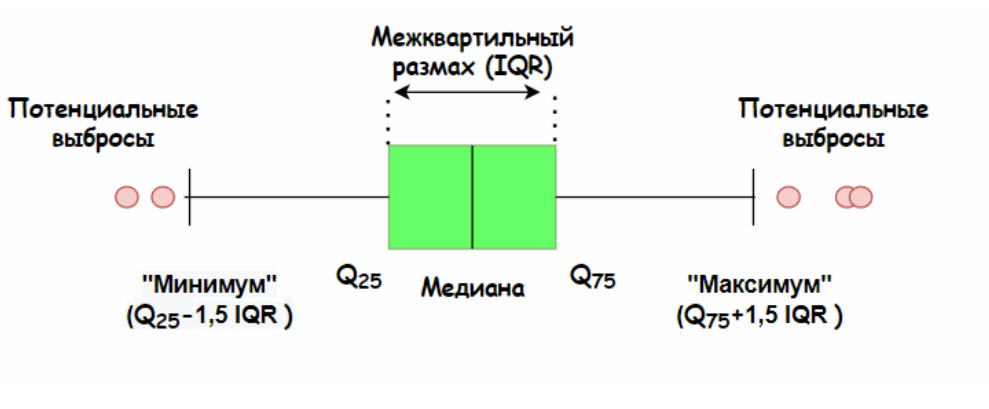
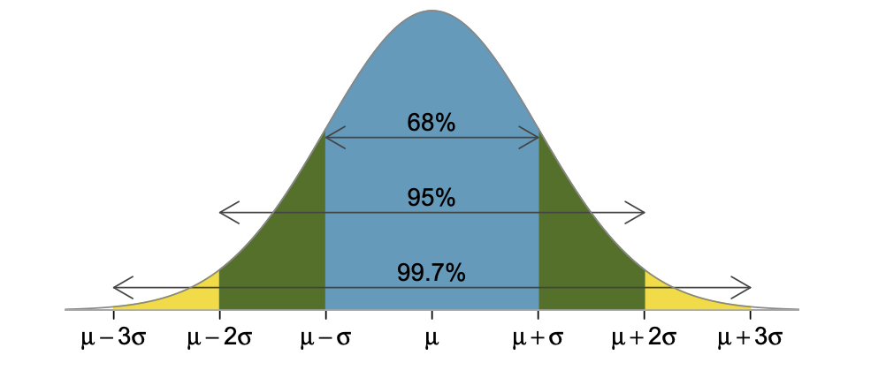

# Статистические методы поиска выбросов

## Понятие выброса
Одним из этапов очистки данных является поиск выбросов.

***Выброс (аномалия)*** - это наблюдение, которое существенно выбивается из общего распределения и сильно отличается от других данных.

В данном разделе рассматриваются статистические методы поиска выбросов, а именно:
* Метод межквартильного размаха
* Метод z-отклонений (метод сигм)

## Метод межквартильного размаха



### Алгоритм метода:

1. Вычислить 25-ую и 75-ую квантили (1 и 3 кватили) - $Q_{25}$ и $Q_{75}$ для признака , который мы исследуем
2. Вычислить межквартильное расстояние:
   * $IQR = Q_{75} - Q_{25}$
3. Определить верхнюю и нижнюю границу Тьюки:

   * $bound_{upper} = Q_{75} + 1.5*IQR$

   * $bound_{lower} = Q_{25} - 1.5*IQR$
4. Найти наблюдения, которые выходят за пределы границ

### **Недостатки метода:**

Можно попробовать воспользоваться методами преобразования данных, например, логарифмированием, чтобы попытаться свестри распределения к нормальномк или хотя бы к симетриченому.

Также можно добавить варивтивности количеству квартильых размахов в левую и правую сторону распределений.

## Методы z-отклонений (метод сигм)

Правило трех сигм гласит:что если распределение дынных является нормальным, то 99.73% лажат в интервале: $(\mu-3 \sigma$, $\mu+3 \sigma)$,
где
* $\mu$ - математические ожидания(для выборки это среденее значение)
* $\sigma$ - стандартные отклонение.

Наблюдения, которые будут лежать за пределами этого интервала будут считаться выбросами.



### **Алгоритм метода**
1. Вычислить среденее и стандартное отклонение $\mu$ и $\sigma$ для признака, который мы исследуем
2. Определить верхнюю и нижнюю границы:
   * $bound_{lower} = \mu - 3 * \sigma$

   * $bound_{upper} = \mu + 3 * \sigma$
3. Найти наблюдения, которые выходят за пределы границ

### **Недостатки метода:**
Метод требует, чтобы признак, на основе которого происходит поиск выбросов, был распределен нормально.

### **Модификация метода:**

Можно попробовать воспользоваться методами преобразования данных, например, логарифмированием, чтобы попытаться свести распределение к нормальному или хотя бы к симметричному.

Также можно добавить количество стандартных отклоненеий в левую и правую сторону распределений.

## Реализация методов
Методы реализации в виде функций find_outliners_iqr() и find_outliers_score(). Фунункции представлены в файле find_outliers.py. К функциям представлена документация.

## Прмер использования

Обязательными аргументами функций, реализующих методы поиска выбросов являются:
* data(pandas.DataFrame): набор данных (таблица)
* feature (str): имя признака, на основе которого происходит поиск выбросов

Импользование классических подходов без модификаций:
```puthon
# Метод межквартильного размаха
from outliers_lib.find_outliers
import find_outliers_iqr

outliers_iqr, cleaned_iqr = find_outliers_iqr(data, feature)

# Метод z-отклонений
from outliers_lib.find_outliers import find_outliers_z_score

find_outliers_z_score
outliers_z_score, cleaned_z_score = find_outliers_z_score(data, feature)
```
Использование методов с предварительным логорифмированием:
```puthon
outliers_iqr, cleaned_iqr = find_outliers_iqr(data, feature, log=True)
outliers_z_score, cleaned_z_score = find_outliers_z_score(data, feature, log=True)
```
Использование методов с предварительным логарифмированием и добавлением вариативности разброса:
```puthon
outliers_iqr, cleaned_iqr = find_outliers_iqr(data, feature, log=True, left=2, right=2)
outliers_z_score, cleaned_z_score = find_outliers_z_score(data, feature, log=True, left=2, right=2)
```


## Использованные инструменты и библиотеки
* numpy(1.20.3)
* pandas (1.3.4)

## Дополнительные источники:
* [Нормальное распределение](https://ru.wikipedia.org/wiki/Нормальное_распределение)
* [Методы межквартильного размаха](https://recture.ru/common/chto-takoe-pravilo-mezhkvartilnogo-razmaha/)
* [Правило трех сигм](https://wiki.loginom.ru/articles/3-sigma-rule.html)
* [Среднеквадратичное отклонение](https://ru.wikipedia.org/wiki/%D0%A1%D1%80%D0%B5%D0%B4%D0%BD%D0%B5%D0%BA%D0%B2%D0%B0%D0%B4%D1%80%D0%B0%D1%82%D0%B8%D1%87%D0%B5%D1%81%D0%BA%D0%BE%D0%B5_%D0%BE%D1%82%D0%BA%D0%BB%D0%BE%D0%BD%D0%B5%D0%BD%D0%B8%D0%B5)